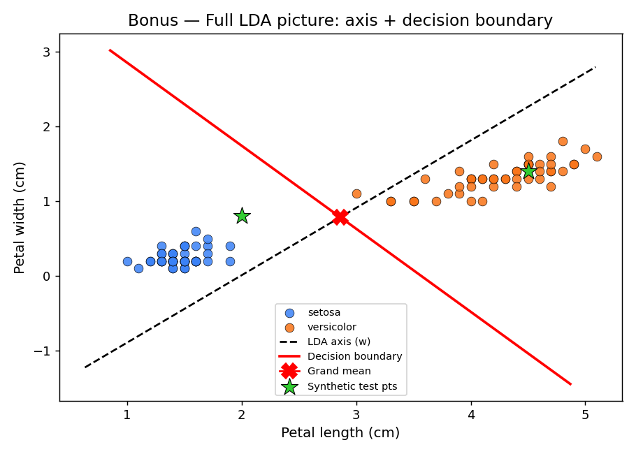
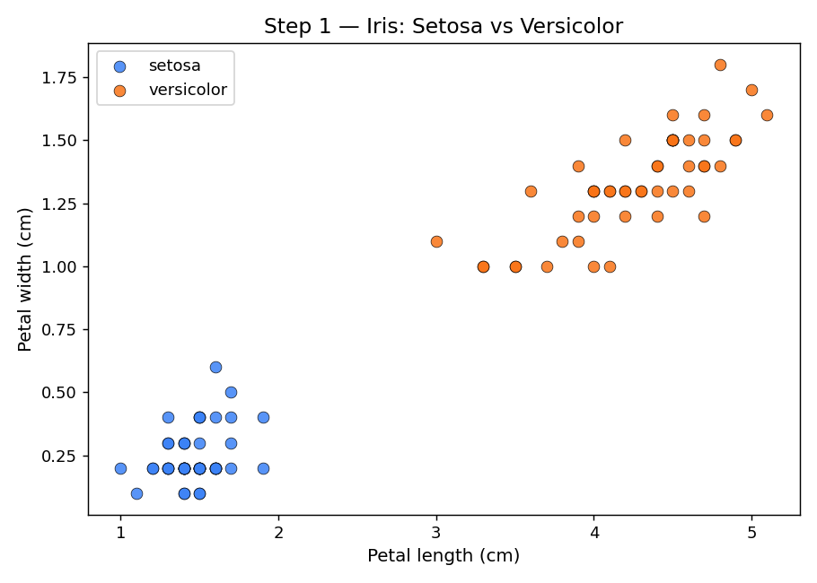
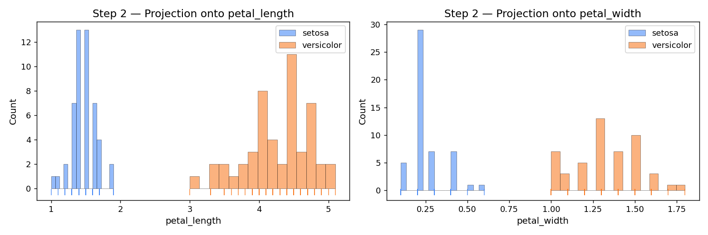
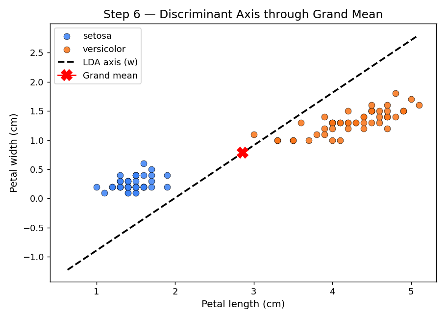
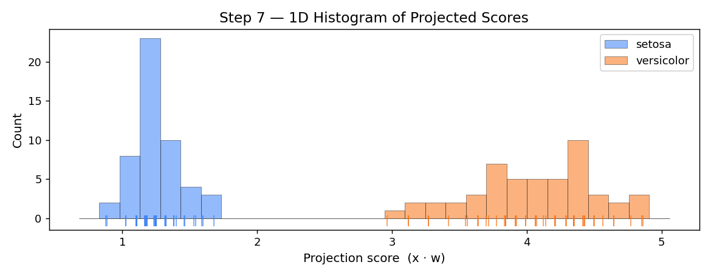
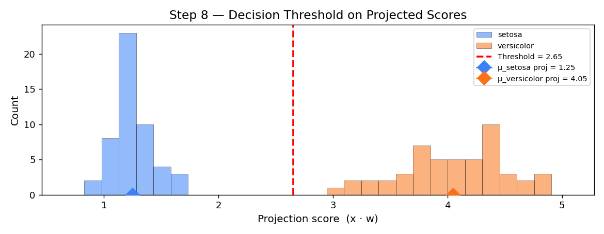

# Linear Discriminant Analysis from Scratch

A step-by-step implementation of **Fisher's Linear Discriminant Analysis (LDA)** built entirely from scratch using **NumPy** and **Pandas** — no scikit-learn classifiers, no black boxes. Every matrix, eigenvector, and decision boundary is computed manually so you can see exactly how LDA works under the hood.



---

## Table of Contents

- [Overview](#overview)
- [Interactive Web App](#interactive-web-app)
- [Mathematical Foundation](#mathematical-foundation)
- [Step-by-Step Walkthrough](#step-by-step-walkthrough)
- [Getting Started](#getting-started)
- [Project Structure](#project-structure)
- [Results](#results)
- [Dependencies](#dependencies)
- [License](#license)

---

## Overview

LDA is a classical supervised technique for **dimensionality reduction** and **classification**. Given labelled data, it finds the linear projection that **maximises the ratio of between-class variance to within-class variance** — producing a single axis that best separates the classes.

This project demonstrates LDA on the [Iris dataset](https://archive.ics.uci.edu/ml/datasets/iris) (Setosa vs Versicolor) using only two features: **petal length** and **petal width**. The entire algorithm is transparent: every intermediate matrix is printed and every step is visualised.

### Why from Scratch?

| scikit-learn one-liner | This project |
|---|---|
| `LDA().fit(X, y).transform(X)` | Full derivation in ~440 lines of readable Python |
| Hidden internals | Every matrix (`Sw`, `Sb`, eigenvectors) printed & explained |
| No visual intuition | 6 publication-quality plots showing each stage |

---

## Interactive Web App

The project includes an **interactive LDA Explorer** (`index.html`) that lets you visualise and manipulate the algorithm in real time — no server required, just open the file in your browser.

### Features

- **Rotatable discriminant axis** — use a slider to rotate the projection axis away from the optimal direction and watch how the 2D scatter plot and 1D projections respond instantly
- **Live 1D number-line projection** — data points are shown as dots on a number line (beeswarm layout) instead of a histogram, making individual projections easy to track as the axis rotates
- **Flower classifier** — adjust petal length and petal width sliders to place a test point and see its real-time classification, projection score, and threshold
- **Fisher's ratio bar** — a live gauge showing how the current axis angle compares to the optimal Fisher criterion value
- **Sweep animation** — hit **▶ Sweep** to automatically rotate the axis through 180° and visually understand why the LDA direction is optimal
- **Accuracy tracker** — see how classification accuracy changes as you rotate away from the optimal axis

### Quick Start

```bash
open index.html        # macOS
# or just double-click index.html in your file explorer
```

---

## Mathematical Foundation

LDA maximises **Fisher's criterion** — the generalised Rayleigh quotient:

$$J(\mathbf{w}) = \frac{\mathbf{w}^T S_b \, \mathbf{w}}{\mathbf{w}^T S_w \, \mathbf{w}}$$

Where:

| Symbol | Name | Formula |
|---|---|---|
| $S_w$ | **Within-class scatter** | $\sum_c (X_c - \mu_c)^T (X_c - \mu_c)$ |
| $S_b$ | **Between-class scatter** | $\sum_c n_c (\mu_c - \mu)(\mu_c - \mu)^T$ |
| $\mathbf{w}$ | **Discriminant axis** | Leading eigenvector of $S_w^{-1} S_b$ |

The optimal $\mathbf{w}$ is the eigenvector of $S_w^{-1} S_b$ corresponding to the **largest eigenvalue**. For a 2-class problem there is exactly one non-zero eigenvalue, yielding a single discriminant direction.

---

## Step-by-Step Walkthrough

### Step 1 — Load & Visualise the Data

Load Iris (Setosa + Versicolor, 100 samples) and plot the 2D scatter of petal length vs petal width.



---

### Step 2 — Marginal (Naïve) Projections

Project onto each feature axis independently. The overlapping histograms reveal that **neither single feature separates the classes perfectly** — motivating LDA's combined axis.



---

### Step 3 — Class Statistics

Compute the **mean vectors** for each class ($\mu_{\text{setosa}}$, $\mu_{\text{versicolor}}$) and the **grand mean** ($\mu$) across all samples.

```
μ_setosa     = [1.462 0.246]
μ_versicolor = [4.26  1.326]
μ_overall    = [2.861 0.786]
```

---

### Step 4 — Scatter Matrices

Build the **within-class scatter matrix** $S_w$ (how spread out each class is around its own mean) and the **between-class scatter matrix** $S_b$ (how far apart the class means are).

```
Within-class scatter  Sw (2×2):
  [5.084  1.5732]
  [1.5732 1.296 ]

Between-class scatter Sb (2×2):
  [48.8601 33.8688]
  [33.8688 29.16  ]
```

---

### Step 5 — Solve the Eigenvalue Problem

Compute $S_w^{-1} S_b$ and extract its eigenvectors. The **leading eigenvector** is the discriminant axis $\mathbf{w}$.

```
★ Discriminant axis  w = [0.7454  0.6666]  (unit length)
```

---

### Step 6 — Overlay the Discriminant Axis

Draw the discriminant direction through the grand mean on the original 2D scatter.



---

### Step 7 — Project onto the Discriminant Axis

Collapse all 2D points onto the single LDA direction via the dot product $\text{score} = \mathbf{x} \cdot \mathbf{w}$. The resulting 1D histogram shows **clear separation**.



---

### Step 8 — Decision Threshold

Set the threshold at the **midpoint of the two projected class means**. Points below the threshold are classified as Setosa; points at or above are Versicolor.



---

### Step 9 — Classify & Evaluate

Classify all training points plus two synthetic test points, and report accuracy.

```
Full-dataset accuracy:  100/100 = 100.0%
```

---

### Bonus — Full Picture

Overlay the LDA axis, decision boundary, class means, and synthetic test points on the original scatter for a complete visual summary.


---

## Getting Started

### Prerequisites

- Python 3.8+
- pip or conda

### Installation

```bash
# Clone the repository
git clone https://github.com/NotB3NZ/Linear-Discriminant-Analysis-from-Scratch-using-Numpy-and-Pandas.git
cd Linear-Discriminant-Analysis-from-Scratch-using-Numpy-and-Pandas

# (Optional) Create a virtual environment
python -m venv .venv
source .venv/bin/activate   # Windows: .venv\Scripts\activate

# Install dependencies
pip install numpy pandas matplotlib scikit-learn
```

### Run

```bash
python lda_from_scratch.py
```

The script will print detailed output for each step and display/save **6 PNG plots** in the working directory.

---

## Project Structure

```
.
├── lda_from_scratch.py        # Main script — full LDA pipeline
├── index.html                 # Interactive LDA Explorer web app
├── step1_scatter.png          # 2D scatter of Setosa vs Versicolor
├── step2_marginals.png        # Per-feature histograms
├── step6_axis.png             # Discriminant axis overlaid on scatter
├── step7_projection.png       # 1D projected score histograms
├── step8_threshold.png        # Threshold on projected scores
├── bonus_full_picture.png     # Complete LDA visualisation
└── README.md
```

---

## Results

| Metric | Value |
|---|---|
| **Classes** | Setosa vs Versicolor |
| **Features** | Petal length, Petal width |
| **Samples** | 100 (50 per class) |
| **Training Accuracy** | **100%** |
| **Discriminant Axis** | `w = [0.7454, 0.6666]` |

---

## Dependencies

| Package | Purpose |
|---|---|
| [NumPy](https://numpy.org/) | Linear algebra (scatter matrices, eigen-decomposition) |
| [Pandas](https://pandas.pydata.org/) | Data wrangling & grouping |
| [Matplotlib](https://matplotlib.org/) | All visualisations |
| [scikit-learn](https://scikit-learn.org/) | **Only** for loading the Iris dataset (`load_iris`) |

> **Note:** scikit-learn is used *exclusively* to load the Iris dataset. The entire LDA algorithm is implemented from scratch.

---

## License

This project is open source and available under the [MIT License](LICENSE).
